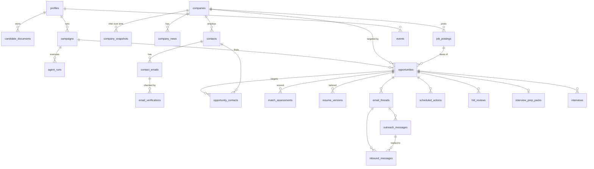

# Database Schema (Supabase Postgres)

**Status: PROPOSED, all open questions resolved (2026-10-01), awaiting lemon's final approval.** Once approved, this becomes `supabase/migrations/0001_init.sql`. No SQL has been written yet. Connectivity to the Supabase project is verified (Postgres 17.11 via session pooler).

Covers the whole agent: every field from the PDF's A-AN schema (mapping in section 7), plus agent runs, HITL gates, scheduling, events/analytics, and embeddings. Supersedes the SQLite plan in `05-master-database.md`.

Decisions this design is built on (lemon, 2026-10-01):

| Decision | Choice |
| --- | --- |
| Tenancy | Multi-user ready: `user_id` on every table, Supabase Auth + RLS from day one |
| Engine | Straight to Postgres on Supabase, no SQLite phase. Postgres-native features allowed |
| Company data | **Per-user copies** (answer 1). No cross-user sharing or dedupe of companies/news/postings |
| Embedding model | **Deferred** (answer 2): `embeddings` table created without the vector column; the column (and its dimension) is added by a later migration once the model is picked, before Stage 2 semantic matching is built |
| File storage | **Supabase Storage** (answer 3): private buckets for resumes and prep files |
| Email retention | **Full reply text** (answer 4), as the PDF specifies |
| FACTS modeling | **Deferred** (answer 5): `candidate_facts` / `resume_claims` NOT in the initial migration; FACTS.md stays a plain file the resume stage reads, resume_lab-style. Sketch kept in section 10 |
| Not included now | Dedicated LLM usage table, A/B testing tables, LangGraph checkpoint tables. Each has an expansion hook noted in section 10 |

Grounding used: Supabase RLS docs (policy per operation, `(select auth.uid())` wrapping, index every policy column, `security_invoker` views, revoke default grants), Supabase pgvector docs (extension in `extensions` schema, HNSW filtering caveat), Supabase partitioning docs (avoid partitioning until needed), OpenRouter embeddings docs (`/embeddings` endpoint, cosine similarity recommended, cache embeddings since output is deterministic).

---

## 1. Design principles

1. **Normalized core, jsonb edges.** Anything queried, filtered, joined, or aggregated is a real column. Anything descriptive, variable, or not yet understood goes in an `attributes jsonb not null default '{}'` column. New fields start in `attributes`; when they prove useful they get promoted to a column by migration. This is the "scope for expansion" mechanism.
2. **Everything is per-user.** No table is shared across users: company intel, news, and postings are researched per user and owned per user (lemon's answer 1). Trade-off accepted: if a second user ever arrives, the same company gets researched twice. All tables get standard `user_id` RLS.
3. **History, not overwrites.** Company intelligence is captured as time-stamped snapshots; scores are versioned assessments; status changes are events. Analytics depend on knowing what was true when.
4. **Every state change emits an event**, written in the same transaction as the change. The `events` table is the analytics backbone and the audit log.
5. **Rules are config, not code.** The PDF's numbers (threshold 6, follow-up at day 7, close at day 14, Mon-Fri 8:30 AM IST, 5-10 sends/day, cap 20) live in `profiles` columns with those defaults, so they can be tuned per user and later optimized from the send-time analytics.
6. **Idempotent by construction.** Unique keys on external IDs (Gmail message/thread/draft IDs, job posting URLs, emails per user, content hashes) so an agent retry never duplicates rows.
7. **State columns use `text` + `CHECK`**, not Postgres enums. A CHECK constraint can be altered in one migration; enum values cannot be removed. Extensible vocabularies (event types) use a lookup table instead.

### Conventions

- PKs: `uuid default gen_random_uuid()`. Exception: `events` uses `bigint generated always as identity` (append-heavy, smaller index). Switch to `uuidv7()` once Supabase ships Postgres 18 for time-ordered UUIDs.
- Timestamps: `timestamptz`, stored UTC. The user's timezone lives in `profiles.timezone`; sent messages also record the timezone in force at send time, so analytics stay correct if the setting changes.
- Every table: `created_at timestamptz not null default now()`; mutable tables also `updated_at` maintained by a `moddatetime` trigger.
- Emails and domains: `citext` (case-insensitive uniqueness).
- Money: `numeric(16,2)` plus `currency char(3)`.
- FKs: always indexed. User-owned FKs `on delete cascade` from `auth.users`.

## 2. Schema layout

| Schema | Contents | Exposed via Data API |
| --- | --- | --- |
| `public` | All app tables below, RLS on every one | Yes (for a future dashboard) |
| `private` | `security definer` helper functions, materialized views, rollup jobs | No |
| `extensions` | `vector`, `citext`, `moddatetime` | No |
| `langgraph` (reserved) | LangGraph Postgres checkpointer tables, if added later | No |

The Python agent connects server-side (Supavisor pooler) with a privileged role that bypasses RLS and always writes `user_id` explicitly. Browser/dashboard clients only ever use the `authenticated` role under RLS.

## 3. Entity overview



Every entity above is user-owned (per-user company data, answer 1); the `user_id` edges are omitted from the diagram for readability.

Grain: **one `opportunities` row = one user + company + role**, exactly the PDF's "one row = one Company + Role". Everything per-pipeline hangs off it.

## 4. Tables

Notation: `PK`, `FK`, `U` = unique, `NN` = not null. `user_id` on user-owned tables is always `uuid NN FK auth.users on delete cascade` and is omitted from the column lists below for brevity.

### A. User and configuration

**`profiles`** (1:1 with `auth.users`, PK = `user_id`)

| Column | Type | Notes |
| --- | --- | --- |
| full_name | text NN | Used in subject line "[Role] Application - <name>" and attachment naming |
| signature | jsonb | `{linkedin, github, phone}` for the sign-off |
| timezone | text NN default `'Asia/Kolkata'` | IST per the PDF |
| send_days | smallint[] NN default `{1,2,3,4,5}` | ISO weekdays, Mon-Fri |
| send_time | time NN default `'08:30'` | Local time in `timezone` |
| daily_send_cap | smallint NN default 10, CHECK 1-20 | PDF: 5-10/day, never >20 |
| match_threshold | smallint NN default 6, CHECK 0-10 | Quality gate |
| follow_up_after_days | smallint NN default 7 | |
| close_after_days | smallint NN default 14 | |
| max_follow_ups | smallint NN default 1, CHECK 0-3 | PDF says one nudge; its "3+" rule becomes the hard ceiling |
| auto_reply_recheck_days | smallint NN default 5 | |
| settings | jsonb NN default `{}` | Expansion |

### B. Candidate inputs

**`candidate_documents`**: versioned copies of the Phase 1 inputs (base resume, projects markdown, FACTS.md kept as-is). FACTS is stored as a document copy only; per-fact atomization is deferred (section 10).

| Column | Type | Notes |
| --- | --- | --- |
| id | uuid PK | |
| kind | text NN, CHECK in (`base_resume_tex`, `projects_md`, `facts_md`, `other`) | |
| version | int NN | U (user_id, kind, version) |
| content | text | Source text |
| content_sha256 | text NN | Skip re-ingest when unchanged |
| is_active | boolean NN default true | Partial U (user_id, kind) where is_active |
| attributes | jsonb | e.g. parsed sections, extracted technologies |

### C. Campaigns and agent runs

**`campaigns`**: one role/interest prompt = one batch ("50 companies per run").

| Column | Type | Notes |
| --- | --- | --- |
| id | uuid PK | |
| name | text | |
| role_prompt | text NN | Natural-language input |
| parsed_signals | jsonb | Seniority, company stage, tech, extracted in Phase 1 |
| target_company_count | smallint NN default 50 | |
| status | text NN CHECK in (`draft`, `active`, `paused`, `completed`, `archived`) | |
| settings | jsonb | Per-campaign overrides of profile rules |

**`agent_runs`**: every LangGraph execution.

| Column | Type | Notes |
| --- | --- | --- |
| id | uuid PK | |
| campaign_id | uuid FK nullable | Null for global jobs like inbox polling |
| graph_name | text NN | e.g. `discovery`, `tracking` |
| trigger | text CHECK in (`manual`, `scheduled`, `event`) | |
| status | text NN CHECK in (`running`, `waiting_hitl`, `succeeded`, `failed`, `cancelled`) | |
| langgraph_thread_id | text | Link to checkpointer thread if added later |
| started_at / finished_at | timestamptz | |
| stats | jsonb | Counts produced, cost totals |
| error | jsonb | |

### D. Company intelligence (per user, per answer 1)

All four tables are user-owned with standard `user_id` RLS. Uniqueness is scoped per user, so the same company can exist for two users and that is by design.

**`companies`**

| Column | Type | Notes |
| --- | --- | --- |
| id | uuid PK | |
| name | text NN | PDF col A |
| domain | citext | Partial U (user_id, domain) where not null; dedupe key within a user |
| website_url | text | PDF col C |
| linkedin_url | text | |
| careers_url | text | |
| locations | text[] | PDF col G (HQ first) |
| industry | text | |
| headcount_range | text | e.g. `51-200` |
| latest_snapshot_id | uuid FK company_snapshots | Denormalized pointer for fast reads |
| attributes | jsonb | |

Near-duplicate names without a domain ("Acme AI" vs "Acme.ai") are caught via embeddings once activated (section N); until then, domain-normalization rules in the Stage 1 node handle it.

**`company_snapshots`**: intelligence at a point in time. Append-only.

| Column | Type | Notes |
| --- | --- | --- |
| id | uuid PK | |
| company_id | uuid FK NN | |
| captured_at | timestamptz NN | |
| run_id | uuid FK agent_runs | |
| funding_stage | text | PDF col E |
| funding_amount / funding_currency | numeric / char(3) | |
| funding_date | date | |
| headcount | int | PDF col F |
| growth_signal | jsonb | PDF col H: hiring velocity, YoY headcount |
| sentiment_score | numeric(2,1) CHECK 1-5 | PDF col J |
| sentiment_detail | jsonb | Per-source Glassdoor/Blind |
| leadership | jsonb | PDF col K: names, bios, investors |
| valuation / revenue | numeric | PDF col L |
| traffic | jsonb | Similarweb/Crunchbase |
| sources | jsonb | OpenRouter `url_citation` annotations, kept for provenance |

**`company_news`**: PDF col I, plus red flags and timeline for Stage 7.

| Column | Type | Notes |
| --- | --- | --- |
| id | uuid PK | |
| company_id | uuid FK NN | |
| kind | text CHECK in (`funding`, `launch`, `layoff`, `hiring`, `leadership`, `scandal`, `other`) | |
| title | text NN | |
| url | text | U (user_id, company_id, url) |
| published_at | timestamptz | PDF requires timestamps |
| summary | text | |

**`job_postings`**: role openings found in Stage 1.

| Column | Type | Notes |
| --- | --- | --- |
| id | uuid PK | |
| company_id | uuid FK NN | |
| title | text NN | |
| url | text NN | PDF col D. U (user_id, url) |
| source | text | Job board name |
| location / remote_type / seniority / employment_type | text | |
| description | text | Full JD text |
| parsed | jsonb | Skills, stack, responsibilities, required vs preferred |
| posted_at | timestamptz | |
| first_seen_at / last_seen_at | timestamptz NN | Hiring velocity = new postings per company per week |
| status | text CHECK in (`open`, `closed`, `unknown`) | |

### E. Opportunities (the core grain)

**`opportunities`**

| Column | Type | Notes |
| --- | --- | --- |
| id | uuid PK | |
| campaign_id | uuid FK NN | Campaign that first found it |
| company_id | uuid FK NN | |
| job_posting_id | uuid FK nullable | Null when outreach targets the company without a specific posting |
| role_title | text NN | PDF col B |
| relevance_score | smallint CHECK 1-10 | Stage 1 relevance, distinct from Stage 2 match score |
| status | text NN | CHECK in (`discovered`, `researched`, `scored`, `needs_review`, `qualified`, `disqualified`, `resume_ready`, `drafted`, `in_outreach`, `responded`, `interviewing`, `offer`, `closed`) |
| closed_reason | text | CHECK in (`no_response`, `rejected`, `not_hiring`, `bounced`, `user_skipped`, `offer_accepted`, `offer_declined`, `other`) |
| priority | smallint | |
| tags | text[] NN default `{}` | PDF col AN, GIN indexed |
| notes | text | PDF col AM |
| archived_at | timestamptz | Soft delete |
| attributes | jsonb | |

Constraint: U (user_id, company_id, job_posting_id) **nulls not distinct**, so re-discovery in a later campaign never creates a duplicate; it emits an `opportunity.rediscovered` event instead.

### F. Contacts and email verification (per user, PII)

**`contacts`**

| Column | Type | Notes |
| --- | --- | --- |
| id | uuid PK | |
| company_id | uuid FK NN | |
| full_name / first_name / last_name | text | PDF col M |
| title | text | PDF col N |
| role_type | text CHECK in (`hiring_manager`, `hr`, `ta`, `recruiter`, `founder`, `other`) | |
| linkedin_url | text | PDF col Q |
| linkedin_verified | boolean NN default false | PDF risk mitigation: confirm the profile is real |
| source | text CHECK in (`llm_search`, `hunter`, `careers_page`, `manual`, `other`) | Keeps the Stage 1 "LLM vs finder API" question measurable |
| source_detail | jsonb | Citations, finder confidence |
| attributes | jsonb | |

**`contact_emails`**: one person can have several candidate addresses (pattern guesses, finder results).

| Column | Type | Notes |
| --- | --- | --- |
| id | uuid PK | |
| contact_id | uuid FK NN | |
| email | citext NN | PDF col O. U (user_id, email) |
| is_primary | boolean NN default false | |
| source | text | |
| verification_status | text NN default `unverified` | CHECK in (`unverified`, `valid`, `invalid`, `catch_all`, `risky`, `disposable`, `unknown`). PDF col P, extended for deliverability |
| last_verified_at | timestamptz | |
| bounced_at | timestamptz | Ground truth fed back from Gmail bounces |

**`email_verifications`**: every check ever run, append-only.

| Column | Type | Notes |
| --- | --- | --- |
| id | uuid PK | |
| contact_email_id | uuid FK NN | |
| method | text NN CHECK in (`syntax`, `dns_mx`, `smtp_ping`, `hunter`, `zerobounce`, `neverbounce`, `other`) | Open Stage 1 decision stays open; the schema supports any mix |
| result | text NN | Same vocabulary as `verification_status` |
| raw_response | jsonb | |
| cost | numeric(10,4) | |
| checked_at | timestamptz NN | |

Joining `email_verifications.result` against later `contact_emails.bounced_at` measures which verification method is actually reliable, which turns the Stage 1 ambiguity into a data question.

**`opportunity_contacts`**: who gets contacted for an opportunity.

| Column | Type | Notes |
| --- | --- | --- |
| opportunity_id / contact_id | uuid FK | PK (opportunity_id, contact_id) |
| role | text CHECK in (`primary`, `cc`, `fallback_hr`) | PDF: fall back to general HR if hiring-manager lookup fails |

### G. Matching (Stage 2)

**`match_assessments`**: versioned; re-scoring adds a row.

| Column | Type | Notes |
| --- | --- | --- |
| id | uuid PK | |
| opportunity_id | uuid FK NN | |
| run_id | uuid FK | |
| model | text | OpenRouter model slug |
| scorer_version | text | Prompt/rubric version |
| tech_stack_score | smallint NN CHECK 0-3 | PDF rubric |
| seniority_score | smallint NN CHECK 0-2 | |
| project_relevance_score | smallint NN CHECK 0-3 | |
| company_signal_score | smallint NN CHECK 0-2 | |
| total_score | smallint generated always as (sum of the four) stored | PDF col R |
| threshold_used | smallint NN | Copied from profile at scoring time |
| passed_gate | boolean generated always as (total_score >= threshold_used) stored | |
| keyword_matches | text[] | |
| keyword_gaps | text[] | PDF col S, GIN indexed |
| reasoning | text | |
| is_current | boolean NN default true | Partial U (opportunity_id) where is_current |

Note: the PDF calls the score "1-10", but its components sum to 0-10. The CHECK allows 0.

### H. Resume customization (Stage 3)

**`resume_versions`**

| Column | Type | Notes |
| --- | --- | --- |
| id | uuid PK | |
| opportunity_id | uuid FK NN | |
| base_document_id | uuid FK candidate_documents | |
| base_variant | text | Archetype base (Backend/SDE, AI/ML, Data, Research) |
| tex_source | text | |
| pdf_path | text | Storage path in the `resumes` bucket, e.g. `{user_id}/{opportunity_id}/Prajwal_Pandey_Acme.pdf` |
| storage_backend | text NN default `supabase_storage` | `local` kept as an option |
| compile_status | text NN CHECK in (`pending`, `compiled`, `failed`, `overflow_flagged`) | |
| page_count | smallint | |
| passed_page_gate | boolean | pagecount.py result |
| compile_log | text | |
| customization_summary | jsonb | PDF col T: keywords surfaced, sections edited, items cut |
| gaps_reported | text[] | JD asks with no FACTS backing |
| is_final | boolean NN default false | Partial U (opportunity_id) where is_final |

Claim-level traceability (`resume_claims` linked to atomized `candidate_facts`) is **deferred** per answer 5; FACTS.md remains the plain file the resume stage reads. The deferred design sketch is in section 10.

### I. Mail, threads, replies (Stages 4 and 6)

**`email_threads`**

| Column | Type | Notes |
| --- | --- | --- |
| id | uuid PK | |
| opportunity_id | uuid FK NN | |
| gmail_thread_id | text U | |
| subject | text | |

**`outreach_messages`**: every outbound mail, initial and follow-ups.

| Column | Type | Notes |
| --- | --- | --- |
| id | uuid PK | |
| opportunity_id / thread_id | uuid FK NN | |
| contact_email_id | uuid FK NN | |
| kind | text NN CHECK in (`initial`, `follow_up`) | |
| sequence_no | smallint NN CHECK 0-3 | 0 = initial. U (thread_id, sequence_no) |
| subject / body_text | text | |
| resume_version_id | uuid FK | Attachment |
| attachment_filename | text | `Prajwal_Pandey_[Company].pdf` |
| model | text | OpenRouter slug used for drafting |
| template_key | text | A/B hook, null for now |
| gmail_draft_id / gmail_message_id | text, partial U | |
| status | text NN | CHECK in (`drafting`, `awaiting_approval`, `approved`, `scheduled`, `sent`, `bounced`, `failed`, `cancelled`, `rejected`). PDF cols W, AC |
| drafted_at | timestamptz | PDF col V |
| approved_at | timestamptz | |
| scheduled_for | timestamptz | Next valid send slot |
| sent_at | timestamptz | PDF cols X, AD |
| send_timezone | text | Timezone in force at send, for send-time analytics |
| follow_up_due_at | timestamptz | PDF col AB (sent_at + follow_up_after_days) |
| word_count | smallint | Tone rule check (150-200 words) |

**`inbound_messages`**: replies, auto-replies, forwards.

| Column | Type | Notes |
| --- | --- | --- |
| id | uuid PK | |
| thread_id / opportunity_id | uuid FK NN | |
| in_reply_to_message_id | uuid FK outreach_messages | Distinguishes reply to initial vs follow-up (PDF col AE) and powers time-to-response |
| gmail_message_id | text NN U | |
| from_email / from_name | citext / text | |
| is_from_contacted_address | boolean NN | False = forward detection |
| received_at | timestamptz NN | PDF col Z |
| body_text | text | PDF col AA |
| classification | text NN default `unclassified` | CHECK in (`unclassified`, `auto_reply`, `interview_request`, `forwarded`, `rejection`, `not_hiring`, `positive_other`, `other`). PDF col Y |
| classification_method | text CHECK in (`rule`, `llm`, `manual`) | |
| classification_confidence | numeric(3,2) | |
| model | text | |
| needs_manual_review | boolean NN default false | Rejections and ambiguous mails |

### J. Scheduling (durable job queue)

**`scheduled_actions`**: replaces in-memory timers, so the Day 7 / Day 14 / 5-day-recheck logic survives restarts.

| Column | Type | Notes |
| --- | --- | --- |
| id | uuid PK | |
| opportunity_id | uuid FK | |
| action | text NN CHECK in (`send_message`, `check_follow_up`, `recheck_auto_reply`, `close_no_response`, `run_discovery`, `poll_inbox`) | |
| target_id | uuid | e.g. the message to send |
| due_at | timestamptz NN | |
| status | text NN CHECK in (`pending`, `running`, `done`, `failed`, `cancelled`) | |
| attempts | smallint NN default 0 | |
| locked_at / locked_by | timestamptz / text | Workers claim with `for update skip locked` |
| last_error | text | |

Partial index `(due_at) where status = 'pending'` keeps the worker poll cheap. Cancellation rules (rejection, not hiring, interview) flip pending rows to `cancelled`.

### K. HITL reviews (all human gates in one place)

**`hitl_reviews`**

| Column | Type | Notes |
| --- | --- | --- |
| id | uuid PK | |
| opportunity_id | uuid FK | |
| gate | text NN CHECK in (`low_match`, `draft_approval`, `follow_up_approval`, `resume_overflow`, `response_classification`) | Every HITL gate across the 7 stage docs |
| subject_type / subject_id | text / uuid NN | Polymorphic pointer (match_assessment, outreach_message, resume_version, inbound_message) |
| status | text NN CHECK in (`pending`, `approved`, `rejected`, `edited`) | |
| run_id | uuid FK | |
| interrupt_id | text | LangGraph interrupt to resume |
| requested_at / decided_at | timestamptz | |
| decision_note | text | |

Trade-off: the polymorphic pointer has no FK integrity. Accepted because it lets a dashboard show one review inbox and gives clean analytics (approval rate, review latency per gate). Integrity is checked by a trigger per `subject_type`.

### L. Interview prep (Stage 7)

**`interview_prep_packs`**: one per opportunity.

| Column | Type | Notes |
| --- | --- | --- |
| id | uuid PK | U (opportunity_id) |
| opportunity_id | uuid FK NN | |
| trigger_message_id | uuid FK inbound_messages | |
| status | text CHECK in (`pending`, `researching`, `ready`, `stale`) | |
| company_deep_dive_path | text | PDF col AF |
| role_deep_dive_path | text | PDF col AG |
| fit_analysis | jsonb | PDF col AH |
| interview_structure | jsonb | PDF col AI: rounds, formats, topics, timing |
| top_questions | jsonb | PDF col AJ |
| prep_plan_path | text | PDF col AK |
| storage_backend | text NN default `supabase_storage` | |
| sources | jsonb | |

**`interviews`**: PDF col AL, one row per round.

| Column | Type | Notes |
| --- | --- | --- |
| id | uuid PK | |
| opportunity_id | uuid FK NN | |
| round_no | smallint NN | |
| round_name / format | text | screening, coding, system design... / online, in-person, async |
| scheduled_at | timestamptz | |
| duration_minutes | smallint | |
| outcome | text CHECK in (`pending`, `passed`, `failed`, `cancelled`, `no_show`) | |
| notes | text | |

### M. Events (analytics backbone)

**`event_types`** (lookup, global): `key text PK` (e.g. `message.sent`), `description`, `payload_schema jsonb`. New event types are rows, not migrations.

**`events`**: append-only, never updated.

| Column | Type | Notes |
| --- | --- | --- |
| id | bigint identity PK | |
| user_id | uuid NN | |
| occurred_at | timestamptz NN default now() | |
| event_type | text NN FK event_types | |
| entity_type / entity_id | text / uuid | What changed |
| opportunity_id | uuid | Denormalized: funnel queries skip joins |
| campaign_id | uuid | Denormalized |
| run_id | uuid | |
| actor | text CHECK in (`agent`, `user`, `system`) | |
| payload | jsonb NN default `{}` | e.g. `{from: "scored", to: "qualified"}` |
| schema_version | smallint NN default 1 | |

Starter vocabulary: `opportunity.created`, `opportunity.status_changed`, `opportunity.rediscovered`, `company.snapshot_captured`, `contact.found`, `email.verified`, `email.bounced`, `match.scored`, `hitl.requested`, `hitl.decided`, `resume.compiled`, `resume.gate_failed`, `message.drafted`, `message.approved`, `message.scheduled`, `message.sent`, `reply.received`, `reply.classified`, `followup.queued`, `run.started`, `run.finished`. LLM calls can also be logged as `llm.call` events (model, tokens, cost) without a dedicated table.

Indexes: `(user_id, occurred_at desc)`, `(event_type, occurred_at)`, `(opportunity_id)`, `(entity_type, entity_id)`. Not partitioned at launch, per Supabase guidance to avoid partitioning until it is needed. The table is written so that converting to monthly range partitions on `occurred_at` later is mechanical (see section 10).

### N. Embeddings (pgvector, model deferred)

**`embeddings`**: created now, vector column added later.

| Column | Type | Notes |
| --- | --- | --- |
| id | uuid PK | |
| user_id | uuid NN | Per-user world (answer 1); indexes and RLS standard |
| entity_type | text NN CHECK in (`candidate_fact`, `job_posting`, `company`, `resume_claim`) | `candidate_fact` and `resume_claim` activate only if the deferred facts tables are built |
| entity_id | uuid NN | |
| model | text | OpenRouter embedding model slug; **null until the model is picked (answer 2)** |
| content_sha256 | text NN | Skip re-embedding unchanged text (embeddings are deterministic) |

U (entity_type, entity_id, model). The **vector column is deliberately absent**: pgvector needs the dimension fixed at column definition, and the dimension follows the model. When the model is picked (before Stage 2 semantic matching), a migration adds `embedding extensions.vector(N) NN` plus HNSW `vector_cosine_ops` indexes created per entity_type as partial indexes, which sidesteps the pgvector caveat that filtering an HNSW search can return fewer rows than requested.

Uses when activated: JD to FACTS similarity (which real facts best answer a posting, Stage 2 and 3 input; ranking only, never content creation), company dedupe within a user when the domain is unknown, posting dedupe across job boards.

## 5. Security (RLS)

Applied to every `public` table, following the Supabase guide:

1. `alter table ... enable row level security`
2. `revoke all ... from anon, authenticated`, then grant only what the dashboard needs to `authenticated`. `anon` gets nothing anywhere.
3. One policy per operation, always `to authenticated`, always `(select auth.uid()) = user_id` (the `select` wrapper caches the call per statement).
4. A btree index with `user_id` leading on every user-owned table, since policies filter on it.
5. Per-user world (answer 1): every table, including companies/snapshots/news/postings, uses the standard `(select auth.uid()) = user_id` policies. No `using (true)` rows anywhere.
6. `event_types` is the one shared lookup: select-only for `authenticated`, writes by the agent role only.
7. Analytics views use `with (security_invoker = true)` so they respect RLS. Materialized views live in `private` and are exposed only through `security definer` functions that filter on `auth.uid()` (with `set search_path = ''`).
8. Append-only tables (`events`, `email_verifications`, `company_snapshots`): no update/delete grants for anyone except the agent role.
9. **Supabase Storage (answer 3):** private buckets `resumes` and `prep`; object paths `{user_id}/{opportunity_id}/...`; storage policies keyed on the first path segment so each user reaches only their own prefix.
10. Policy tests per table under `supabase/tests/` with pgTAP, run by `supabase test db`.

## 6. Analytics layer

Live views (`security_invoker`), all derived from the tables above:

| View | Answers | PDF metric |
| --- | --- | --- |
| `v_campaign_funnel` | Per campaign: researched, passed gate, drafted, approved, sent, replied, interviews, offers | Total researched, passed gate, mails sent |
| `v_response_rates` | Response rate and interview-request rate by campaign, company stage, industry | Response rate, interview rate |
| `v_time_to_response` | Hours from `sent_at` to first `received_at` (excluding auto-replies), initial vs follow-up | Average time to response |
| `v_send_time_performance` | Reply rate by local weekday and hour of send (`sent_at at time zone send_timezone`) | Lemon's send-time optimization |
| `v_keyword_performance` | Reply/interview rate per keyword in `keyword_matches` and per gap | Best-performing keywords/skills |
| `v_verification_accuracy` | Bounce rate per verification method and result | Stage 1 verification decision |
| `v_hitl_latency` | Time from `requested_at` to `decided_at` per gate, approval rate | Review bottlenecks |

Sample (send-time):

```sql
select extract(isodow from m.sent_at at time zone m.send_timezone) as dow,
       extract(hour   from m.sent_at at time zone m.send_timezone) as hour,
       count(*)                                    as sent,
       count(r.id) filter (where r.classification not in ('auto_reply','unclassified')) as replied
from outreach_messages m
left join inbound_messages r on r.in_reply_to_message_id = m.id
where m.status = 'sent'
group by 1, 2;
```

When views get slow, promote the heavy ones to materialized views in `private`, refreshed by `pg_cron`, or to a `daily_metrics` rollup table. Not needed at launch volumes (tens of mails per week).

## 7. Coverage: PDF columns A-AN to tables

| PDF col | Field | Lives in |
| --- | --- | --- |
| A | Company Name | `companies.name` |
| B | Role Title | `opportunities.role_title` (`job_postings.title`) |
| C | Company URL | `companies.website_url` |
| D | Job Board Link | `job_postings.url`, `.source` |
| E | Funding Status | `company_snapshots.funding_*` |
| F | Company Size | `company_snapshots.headcount`, `companies.headcount_range` |
| G | Locations | `companies.locations` |
| H | Growth Signal | `company_snapshots.growth_signal` + derived from `job_postings` |
| I | Recent News | `company_news` |
| J | Sentiment Score | `company_snapshots.sentiment_score` |
| K | Founders/Leadership | `company_snapshots.leadership` |
| L | Valuation/Revenue | `company_snapshots.valuation`, `.revenue` |
| M | Hiring Manager Name | `contacts.full_name` (role_type `hiring_manager`) |
| N | Hiring Manager Title | `contacts.title` |
| O | HR/TA Email | `contact_emails.email` |
| P | Email Validation Status | `contact_emails.verification_status` + `email_verifications` |
| Q | LinkedIn Profile URL | `contacts.linkedin_url` |
| R | Match Score | `match_assessments.total_score` |
| S | Keyword Gaps | `match_assessments.keyword_gaps` |
| T | Resume Customizations | `resume_versions.customization_summary` |
| U | Customized Resume Link | `resume_versions.pdf_path` |
| V | Draft Date | `outreach_messages.drafted_at` |
| W | Mail Status | `outreach_messages.status`, `opportunities.status` |
| X | Sent Date | `outreach_messages.sent_at` |
| Y | Response Type | `inbound_messages.classification` |
| Z | Response Date | `inbound_messages.received_at` |
| AA | Response Details | `inbound_messages.body_text` |
| AB | Follow-up Due Date | `outreach_messages.follow_up_due_at` + `scheduled_actions` |
| AC | Follow-up Status | `outreach_messages.status` where kind = `follow_up` |
| AD | Follow-up Sent Date | `outreach_messages.sent_at` where kind = `follow_up` |
| AE | Follow-up Response Type | `inbound_messages.classification` via `in_reply_to_message_id` |
| AF | Company Deep-Dive | `interview_prep_packs.company_deep_dive_path` |
| AG | Role Deep-Dive | `interview_prep_packs.role_deep_dive_path` |
| AH | Your Fit Analysis | `interview_prep_packs.fit_analysis` |
| AI | Interview Structure | `interview_prep_packs.interview_structure` |
| AJ | Top 10 Questions | `interview_prep_packs.top_questions` |
| AK | Prep Plan | `interview_prep_packs.prep_plan_path` |
| AL | Interview Schedule | `interviews.scheduled_at` |
| AM | Notes | `opportunities.notes` |
| AN | Tags | `opportunities.tags` |

All 40 covered. Additions beyond the PDF: candidate facts and claim traceability (from resume_lab), verification history, send timezone, scheduling queue, HITL table, agent runs, events, embeddings.

## 8. Index summary

- Every user-owned table: btree leading on `user_id` (RLS)
- Every FK column: btree
- `opportunities (user_id, campaign_id, status)`, GIN on `tags`
- `match_assessments`: GIN on `keyword_gaps`, `keyword_matches`
- `outreach_messages (user_id, status)`, `(scheduled_for) where status = 'scheduled'`, partial U on Gmail IDs
- `inbound_messages (thread_id, received_at)`, `(user_id) where needs_manual_review`
- `scheduled_actions (due_at) where status = 'pending'`
- `hitl_reviews (user_id) where status = 'pending'`
- `events`: as listed in section M
- `embeddings`: partial HNSW per entity_type
- No GIN on `attributes` columns until a query needs it (GIN indexes cost write speed)

## 9. Scaling path

| Trigger | Action |
| --- | --- |
| `events` past roughly tens of millions of rows, or retention needed | Convert to monthly range partitions on `occurred_at` (PK becomes `(occurred_at, id)`), drop old partitions for retention |
| Dashboard views slow | Materialized views in `private` + `pg_cron` refresh, or `daily_metrics` rollup |
| Many concurrent workers | `scheduled_actions` already supports `skip locked`; add workers, no schema change |
| Embedding model change | New rows with the new `model`; if dimensions change, add a second vector column/table and reindex, old rows stay valid |
| Large email bodies | Move `body_text` to Storage, keep a snippet column |

## 10. Deferred and expansion hooks

### Deferred by lemon (2026-10-01)

- **FACTS atomization (`candidate_facts` + `resume_claims`):** revisit when Stage 3 is built. The deferred design, ready to migrate then: `candidate_facts(user_id, document_id FK, line_ref, category, text, status in confirmed/unresolved/false, metadata jsonb)` and `resume_claims(resume_version_id FK, section, position, claim_text, fact_id FK NN)` with a trigger rejecting claims backed by status `false` facts, and one fact per claim to block merge inflation.
- **Embedding model + vector column:** when the model is picked (before Stage 2 semantic matching), a migration adds `embeddings.embedding extensions.vector(N)` for the chosen dimension plus per-entity-type partial HNSW cosine indexes. The `embeddings` rows can start populating (model null) only after that migration.

### Deliberately not built now

- **LLM usage table:** `llm.call` events cover it; promote to a table if cost reporting gets heavy.
- **A/B testing:** `outreach_messages.template_key` already records the variant; add `experiments` and `experiment_variants` tables and join on it.
- **LangGraph checkpointer:** reserved `langgraph` schema; `agent_runs.langgraph_thread_id` and `hitl_reviews.interrupt_id` already link to it.
- **Google Sheets view:** a read-only export of `v_campaign_funnel`-style views, never a source of truth.
- **New fields generally:** add to `attributes` first, promote to columns when queried.

## 11. Open questions: RESOLVED (2026-10-01)

1. Company data: **per-user copies**, no sharing.
2. Embedding model: **deferred**; embeddings table created without the vector column.
3. Files: **Supabase Storage**, private `resumes` and `prep` buckets.
4. Email retention: **full reply text**.
5. FACTS.md: **stays a plain file**; atomization deferred to Stage 3.
